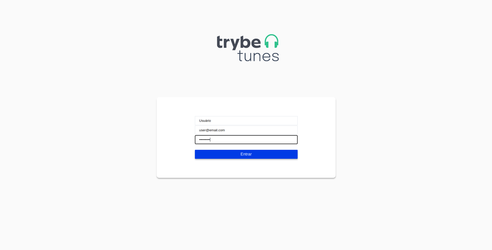
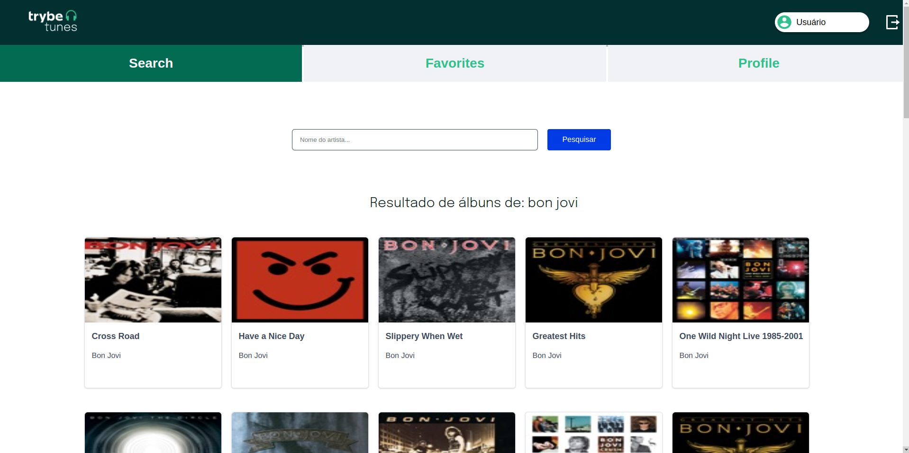
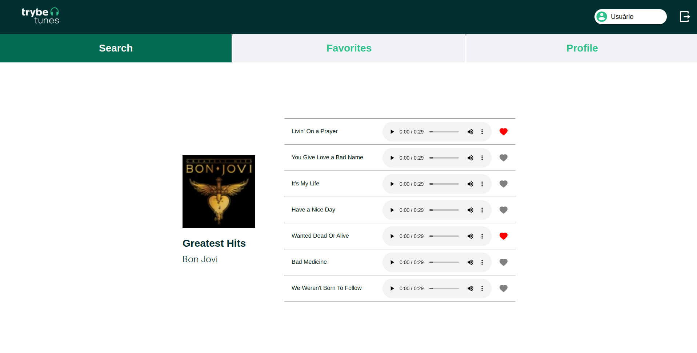
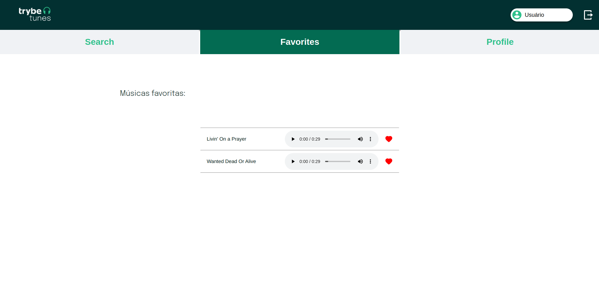
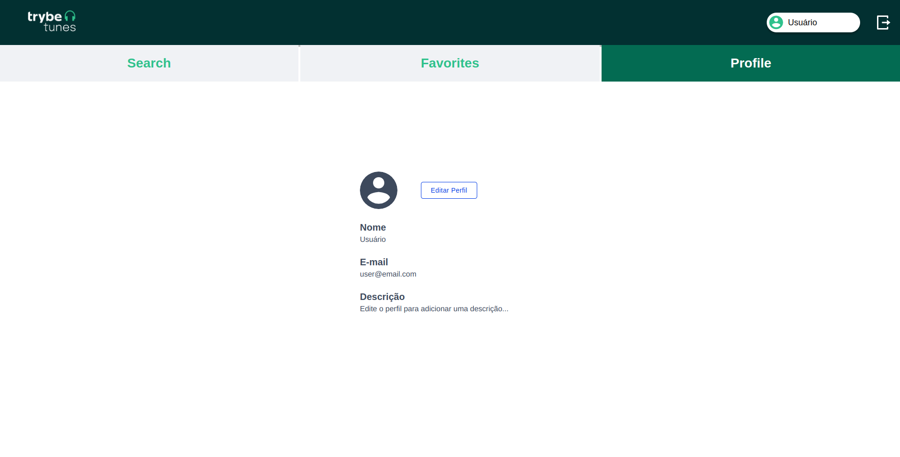
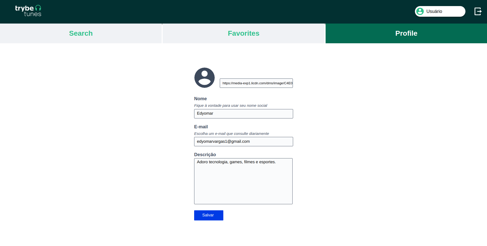
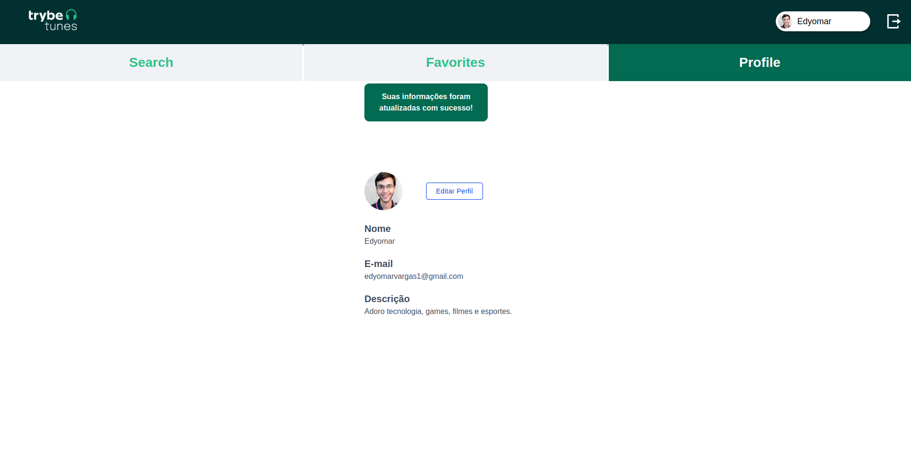
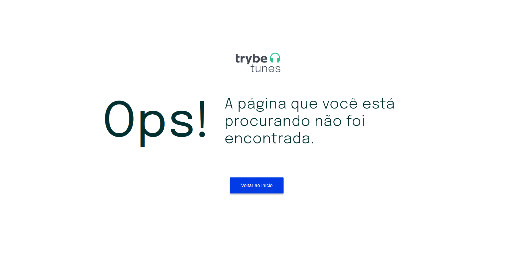

# Boas-vindas ao repositório do projeto TrybeTunes!

O TrybeTunes é uma aplicação capaz de reproduzir músicas das mais variadas bandas e artistas, criar uma lista de músicas favoritas e editar o perfil da pessoa usuária logada.

Esse foi um dos projetos desenvolvidos como critério de avaliação do módulo de Front-end da <a href="https://betrybe.com">Trybe<a/>.

## Sumário
  - [Boas vindas ao TrybeTunes](#boas-vindas-ao-repositório-do-projeto-trybetunes)
  - [Sumário](#sumário)
  - [Habilidades](#habilidades)
  - [Sobre a aplicação](#sobre-a-aplicação)
  - [Tecnologias utilizadas](#tecnologias-utilizadas) 
  - [Código limpo](#código-limpo)
  
## Habilidades
Neste projeto, as seguintes habilidades foram desenvolvidas:
  * Fazer requisições e consumir dados vindos de uma API
  * Gerenciar o estado global da aplicação através de Context API
  * Criar rotas, mapeando o caminho da URL com o componente correspondente, via Route
  * Criar links de navegação na aplicação com o componente Link
  * Utilizar hooks do React como useEffect, useState, useNavigate
  * Estilização e responsividade da aplicação
  
## Sobre a aplicação
Esta aplicação é capaz de:
  * Fazer login
  * Pesquisar por uma banda ou artista
  * Listar os álbuns disponíveis dessa banda ou artista
  * Visualizar as músicas de um álbum selecionado
  * Reproduzir uma prévia das músicas deste álbum
  * Favoritar e desfavoritar músicas
  * Ver a lista de músicas favoritas
  * Ver o perfil da pessoa logada
  * Editar o perfil da pessoa logada
  
## Tecnologias utilizadas
  * JavaScript ES6
  * React
  * Styled Components
  
## Código limpo
  Essa aplicação foi desenvolvida seguindo os padrões de Código Limpo exigidos pela <a href="https://betrybe.com">Trybe<a/> através de suas regras de Lint para aplicações front-end.
  
  Para mais informações sobre o Lint da Trybe, acesse <a href="https://github.com/betrybe/eslint-config-trybe">esse repositório</a>.
  
## Preview
| Login |
| --- |
|  |
  
| Search |
| --- |
|  |
  
| Artist search |
| --- |
|  |
  
| Favorites |
| --- |
|  |
  
| Profile |
| --- |
|  |
  
| Edit profile |
| --- |
|  |
  
| Edited profile |
| --- |
|  |
  
| Page not found |
| --- |
|  |
